# Trust MANAGER and keySTREAM SaaS

This guide provides a clear step-by-step process for onboarding an ECC608 TrustMANAGER with the KeySTREAM SaaS from Kudelski IoT, implementing an cloud usecase using AWS. It's important to note that manual secure exchange processes are not required during manufacturing with this onboarding methodology. The customized root CA and  associated PKI is preconfigured in keySTREAM, and the device certificate is provisioned after the device is deployed to the field.

### During the evaluation of the ECC608 TrustMANAGER and keySTREAM from Kudelski IOT, you will be guided through the following steps:
 - Create keySTREAM account
 - Create your root CA within keySTREAM and its associated PKI
 - Operate certificate management operations remotely from keySTREAM
 - How to run the script and generate the pre-configured Package for the TrustMANAGER
 - Video tutorial on Youtube - available soon !!!

## Setup Requirements
1. Purchase [EV10E69A](https://www.microchip.com/en-us/development-tool/EV10E69A) CryptoAuth Trust Manager development kit.
2. Purchase [WIFI 7 CLICK](https://www.mikroe.com/wifi-7-click) (WINC1500 or WINC1510 Wifi module) from mikroe.com.
3. Download and Install [MPLAB X IDE](https://www.microchip.com/en-us/development-tools-tools-and-software/mplab-x-ide) version 6.15 or above.
------------------------------------------------------------------------------------------------------------------------------------------

## Pre-Use Case Transaction Steps

### keySTREAM Account Setup and Requirements

- Step 1: Creating Kudelski keyStream account
  - Now that we have an AWS account, you have to create an account on Kudelski keySTREAM portal to proceed with the use case. Registration is free.
    - **1.1:** Go to the following link for account creation. [Register link](https://mc.obp.iot.kudelski.com) 
    - **1.2** Click on register.
        <figure style="text-align: center;"><figcaption style="font-weight: bold; text-align: center; clear: both; width: 65%;">Figure 1</figcaption></figure>
    - **1.3** Provide information required for account creation, a verification email will be sent out the provided email. 
        <figure style="text-align: center;"><figcaption style="font-weight: bold; text-align: center; clear: both; width: 65%;">Figure 2</figcaption></figure>
    - **1.4** Look out for the verification code on the registered email. Enter the verification code once it is available to you. Once the right code is entered you should see the successful account creation message.
        <figure style="text-align: center;"><figcaption style="font-weight: bold; text-align: center; clear: both; width: 65%;">Figure 3</figcaption></figure>
- Step 2: Creating [fleet profile](#creating-a-fleet-profile) under Keystream portal.
  - In this step we will create a fleet profile under the Kudelski keystream portal. Fleet profile could represent a product line or a subdivision under a product line. For example, you can setup a fleet profile for a line of internet connected thermostat, this will let you remotely manage those specific devices. During the creation of Fleet profile, we will provide information required for creating Root CA that will be used for these specific set of devices. All the devices under the fleet profile will be signed by this Root CA certificate. Each created fleet profile will always have a Root CA certificate associated with it.
    - **2.1** Login to the Kudelski keystream portal.
         <figure style="text-align: center;"><figcaption style="font-weight: bold; text-align: center; clear: both; width: 65%;">Figure 4</figcaption></figure>
    - **2.2** Upon completing the registration process, you will gain access to your own tenant on the keySTREAM SaaS platform from Kudelski IoT.         

### Signing in on keySTREAM portal

To sign in to the keySTREAM portal, please locate the link provided in the email from **Kudelski IoT Onboarding Portal** confirming the creation of your keySTREAM tenant. This email includes comprehensive instructions, so ensure you review it carefully. 

Alternatively, go back to the keySTREAM portal via this link and click [Login to keySTREAM](https://mc.obp.iot.kudelski.com) 
Once logged in you will be redirected to the home page.
<figure style="text-align: center;"><figcaption style="font-weight: bold; text-align: center; clear: both; width: 65%;">Figure 5</figcaption></figure>

For the upcoming steps, it's essential to be signed in to the keySTREAM portal.

### Creating a Fleet Profile

A Fleet profile
  - Is a label attached to a fleet of devices sharing the same configuration. 
  - Serves as a link between you, the device manufacturer, and the device you will have in the field. 
  - Will be referenced both on keySTREAM and in your device firmware. 
  - Is identified by a **Fleet Profile Public UID** that is easily readable by a human, as further explained below. 

The keySTREAM portal allows creation a Fleet Profile and attach a configuration to it:

- Click on **Fleet & PKI** from left panel as shown in below figure. 
    <figure style="text-align: center;"><figcaption style="font-weight: bold; text-align: center; clear: both; width: 75%;">Figure 6</figcaption></figure>

- Click on **FLEET & CERT** and **CREATE**  as shown in figure below.
    <figure style="text-align: center;">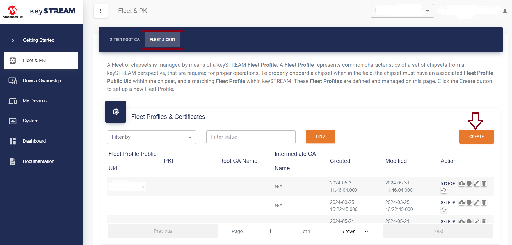<figcaption style="font-weight: bold; text-align: center; clear: both; width: 75%;">Figure 7</figcaption></figure>
- A popup window appears :
    <figure style="text-align: center;"><figcaption style="font-weight: bold; text-align: center; clear: both; width: 75%;">Figure 8</figcaption></figure>

  -  The following fields can be configured :
     - **Fleet Profile Public Uid (required) :** 
        A unique URI string, identifying the Fleet Profile. It is advised to avoid creating two Fleet Profiles with the same name. The final Fleet Profile Public Uid would be a concatenation of an auto-generated prefix (e.g. 9S4F:) and the Fleet Profile Public Uid (example.org:dp:network:device) that has been defined. The final Fleet Profile Public Uid would look like 9S4F:example.org:dp:network:device.
     - **Model, Brand and Manufacturer:** they are optional and purely informational, for your own use.

- Upon clicking on **NEXT**, you can create your own Root Certificate Authority (CA) associated with this new Fleet Profile:
    <figure style="text-align: center;"><figcaption style="font-weight: bold; text-align: center; clear: both; width: 75%;">Figure 9</figcaption></figure>
  
  - This is the step where you create your customized root Certificate Authority. The following fields will have to be configured:
     - **Root CA Common Name (CN):** This field is restricted to a fixed length of 16 Bytes. In case your input is shorter, it will be right-padded with spaces; a longer input will be truncated.

     - **Root CA Organization (O):** This field is restricted to a fixed length of 16 Bytes. In case your input is shorter, it will be right-padded with spaces; a longer input will be truncated. Notice that the Organization Unit will be hardcoded to TrustMANAGER.

     - **Root CA Certificate Validity(Years):** Number of Year(s) of validity of the Root CA.
   
     - **Device Operational Certificate validity (Years):** The number of Year(s) of validity of the Device Operational Certificate. It shall be shorter than the RooT CA Certificate validity.
   
  - After you click on **COMMIT**, a newly configured Fleet Profile with its freshly created custom Root CA appears in the list below: 
    <figure style="text-align: center;"><figcaption style="font-weight: bold; text-align: center; clear: both; width: 75%;">Figure 10</figcaption></figure>

  - All devices that are configured with this Fleet Profile will be provisioned with a unique device certificate signed by the certificate authority (CA) associated to this Fleet Profile when they register on keySTREAM.

  - **Creating a 2-Tier Fleet Profile**
  - If you need to create a 2-Tier Fleet Profile, follow the steps below:
  
    - Root CA of your 2-Tier PKI: You can have only one 2-Tier Root CA, which will sign as many 2-Tier Intermediate CAs as needed.
    - Click on **Fleet & PKI** from the left panel, then select **2-TIER ROOT CA**, and finally click on **OK** as shown in the figure below.
    <figure style="text-align: center;"><figcaption style="font-weight: bold; text-align: center; clear: both; width: 75%;">Figure 11</figcaption></figure>
    - A popup window appears :
    <figure style="text-align: center;"><figcaption
    style="font-weight: bold; text-align: center; clear: both; width: 75%;">Figure 12</figcaption></figure>
   
    - After creating a ROOT CA, a pop-up will appear indicating that it has been successfully created, as shown in the figure below.
    <figure style="text-align: center;"><figcaption
    style="font-weight: bold; text-align: center; clear: both; width: 75%;">Figure 13</figcaption></figure>

    - Click on **FLEET & CERT** and  **CREATE**, as shown in figure below.
    <figure style="text-align: center;"><figcaption
    style="font-weight: bold; text-align: center; clear: both; width: 75%;">Figure 14</figcaption></figure>
    - A popup window appears :
    <figure style="text-align: center;"><figcaption style="font-weight: bold; text-align: center; clear: both; width: 75%;">Figure 15</figcaption></figure>

    - Upon clicking on **NEXT**, you can create your own Root Certificate Authority (CA) associated with this new Fleet Profile:
    <figure style="text-align: center;"><figcaption style="font-weight: bold; text-align: center; clear: both; width: 75%;">Figure 16</figcaption></figure>

    - After you click on **COMMIT**, a newly configured 2-Tier Fleet Profile with its freshly created custom Root CA appears in the list below: 
    <figure style="text-align: center;"><figcaption style="font-weight: bold; text-align: center; clear: both; width: 75%;">Figure 17</figcaption></figure>

------------------------------------------------------------------------------------------------------------------------------------------
## Device claiming using the *Autoclaim* flow 

- The Autoclaim flow applies only if you create the keySTREAM account AND enter your email address used to login into microchipdirect.com BEFORE you place a purchase of ECC608 TrustMANAGER following this specific [this link](https://www.microchipdirect.com/trust-platform).
- There is no need to upload the manifest with the autoclaim flow. This step is completely automated between Microchip and keySTREAM.  
- This flow will NOT work if : 
  - You work with a development kit with an ECC608 TrustMANAGER soldered directly on the PCB like the EV10E69A or DT100104 – use the **Claim by Manifest** flow instead.
  - You purchased your loose ECC608 TrustMANAGER from microchipdirect.com BEFORE opening your keySTREAM account and registering your microchipdirect.com email address.
- Make sure to follow those steps : 
  - Create an account on microchipdirect.com – do not buy the ECC608 TrustMANAGER yet. 
  - Create a keySTREAM account 
  - Go the DEVICE OWNERSHIP in the left navigation menu 
    <figure style="text-align: center;"><figcaption style="font-weight: bold; text-align: center; clear: both; width: 65%;">Figure 18</figcaption></figure>
  - Choose AUTOCLAIMING 
    <figure style="text-align: center;">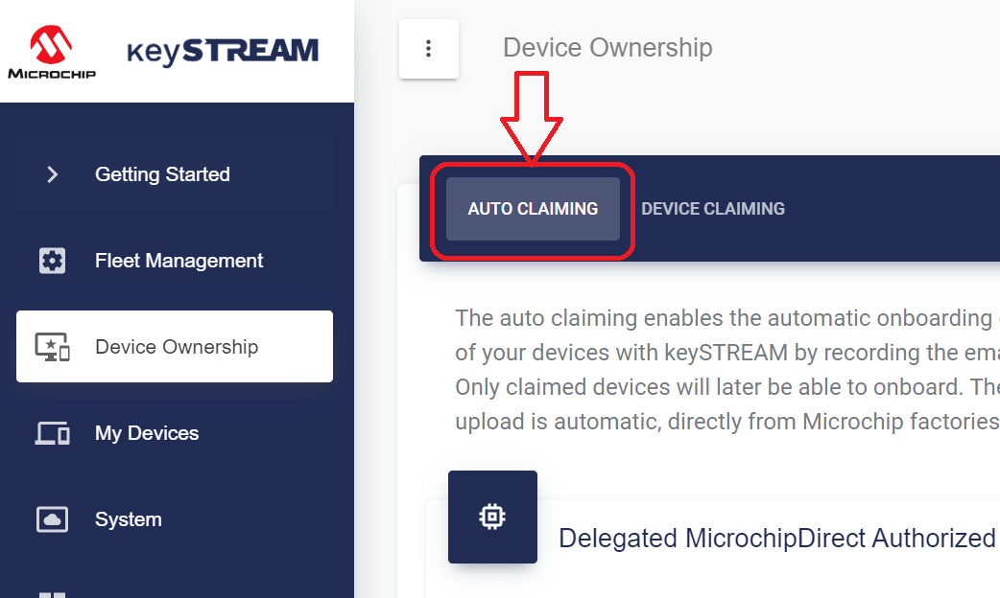<figcaption style="font-weight: bold; text-align: center; clear: both; width: 65%;">Figure 19</figcaption></figure>    
  - Click on the button CREATE
    <figure style="text-align: center;"><figcaption style="font-weight: bold; text-align: center; clear: both; width: 65%;">Figure 20</figcaption></figure>
  - The following window pops up. The field MicrochipDirect Purchaser is where you enter the email address used to log into your microchipdirect.com account.
    <figure style="text-align: center;"><figcaption style="font-weight: bold; text-align: center; clear: both; width: 65%;">Figure 21</figcaption></figure>  
  - Choose ECC608-TMNGTLS in the Chip Part Number field and click COMMIT. Your device will show up in your DEVICE OWNERSHIP window as **Claimed**. They will turn to **Active** once the infield provisioning is successful.

------------------------------------------------------------------------------------------------------------------------------------------
## AWS Setup Requirements

The following steps are required if your device needs to communicate with AWS over a TLS session. These steps are **not** required for onboarding with keySTREAM and are only applicable for the D21 preconfigured example.

---

### AWS Account Setup Instructions

To run the AWS Cloud Connect use cases, you must have an AWS account. This section describes the steps required to obtain and configure an AWS account for the demo.

[Amazon Web Services (AWS)](https://aws.amazon.com/) provides computing services for a fee. Some services are offered for free on a trial or small-scale basis. 
By signing up for your own AWS account, you gain access to a wide range of computing services.

Think of your AWS account as your root account for AWS services. It is very powerful and gives you complete access. Be sure to protect your username and password. You control access to your AWS account by creating individual users and groups using the Identity and Access Management (IAM) Console. From the IAM Console, you can also assign policies (permissions) to groups.

---

### Create Your Own AWS Account

1. **Create an AWS account**
    - Go to [AWS account](https://aws.amazon.com/) and follow the instructions to create your own AWS account. 
    - Additional details can be found at the [AWS Account Creation and Activation Guide](https://aws.amazon.com/premiumsupport/knowledge-center/create-and-activate-aws-account/).

2. **Secure the root account with MFA (Multi-Factor Authentication)**
    - This is an important step to better secure your root account against attackers. 
    - Anyone logging in will need both the password and a constantly changing code generated by an MFA device.
    - AWS recommends several MFA device options: [MFA device options](https://aws.amazon.com/iam/details/mfa/)
    - The quickest solution is an MFA app running on a phone. These apps allow you to scan a QR code provided by AWS to set up the MFA device.
    - Steps:
        1. Return to [AWS account](https://aws.amazon.com/) and click **Sign In to the Console**.
        2. If prompted for an IAM user name and password, select **Sign-in using root account credentials**.
        3. Enter the email and password for your AWS account.
        4. Under **Find Services**, search for **IAM** and select it to bring up the Identity and Access Management options.
        5. Click on **Activate MFA (Multi-factor Authentication) on your root account**.

3. **Create an admin IAM user**
    - AWS best practices recommend not using your root account for standard administrative tasks. Instead, create a special admin user for those tasks. See [Best Practices for Securing AWS IAM Credentials](https://docs.aws.amazon.com/IAM/latest/UserGuide/best-practices.html#lock-away-credentials).

4. **Create an AWS IAM Admin Group**
    - Follow the instructions at [Creating an AWS IAM Admin Group](https://docs.aws.amazon.com/IAM/latest/UserGuide/getting-started_create-admin-group.html) to create an admin user.

5. **Enable MFA for the admin user**
    - See [AWS IAM Best Practices: Enable MFA for Privileged Users](https://docs.aws.amazon.com/IAM/latest/UserGuide/best-practices.html#enable-mfa-for-privileged-users).

### Step-by-Step Provisioning Guide

1. **Download CA Certificate from keySTREAM**

    - Log in to the keySTREAM portal.
    - Navigate to your Fleet Profile.
    - Download the CA certificate (see **Figure 22**).
    <figure style="text-align: center;"><figcaption style="font-weight: bold; text-align: center; clear: both; width: 65%;">Figure 22</figcaption></figure>

2. **Register CA Certificate in AWS IoT Core**

    - Go to **AWS IoT Core > Security > Certificate authorities**.
    - Click **Register CA certificate**.
    - Select **Register CA in Single-account mode** (see **Figure 23**).
    <figure style="text-align: center;"><figcaption style="font-weight: bold; text-align: center; clear: both; width: 65%;">Figure 23</figcaption></figure>

3. **Get AWS Registration Code and Download PoP Certificate** from keySTREAM

    - AWS will display a **registration code**. 
    - Copy this code; you will need it in the next step.
    - Use the AWS registration code in keySTREAM to download the PoP certificate from the keySTREAM portal (see **Figure 24**).
    <figure style="text-align: center;"><figcaption style="font-weight: bold; text-align: center; clear: both; width: 65%;">Figure 24</figcaption></figure>

 4. **Upload and Activate Certificates in AWS**

    - Upload the CA certificate you downloaded from keySTREAM.
    - Upload the PoP certificate in AWS (see **Figure 25**).
    <figure style="text-align: center;"><figcaption style="font-weight: bold; text-align: center; clear: both; width: 65%;">Figure 25</figcaption></figure>

5. **Finalize CA Registration in AWS IoT Core**

    - Activate the CA status and enable automatic certificate registration.
    - Click **Register** to complete the process (see **Figure 26**).
    <figure style="text-align: center;"><figcaption style="font-weight: bold; text-align: center; clear: both; width: 65%;">Figure 26</figcaption></figure>

## Running the Configuration Script and Generating Your Device Package

Follow these steps to generate a pre-configured package for your desired device:

- Run the configuration script (`Config.ps1`).
- Select the **TrustMANAGER** folder when prompted.
- Choose your desired device type: **D21**, **SAME54**, or **SG41** (these are pre-configured device options).
- Enter the required information when prompted (such as WiFi SSID, WiFi password, and Fleet Profile UID).
- The script will generate the package and display the path to the generated MPLAB X project file.
- Open the provided `.X` project file in **MPLAB X IDE** to continue with the rest of the process (see **Figure 27**).
<figure style="text-align: center;"><figcaption style="font-weight: bold; text-align: center; clear: both; width: 65%;">Figure 27</figcaption></figure>

---

**Note:** 

- Ensure that your project file is located in a short directory path. Long file paths may cause build and compilation failures.
- If you are using a D21 device, please ensure that the Fleet Profile is not linked to FOTA services.
- If you are using a SAME54 device, please ensure that your entire project path is located in short directory path (for ex. C:\). Otherwise you may encounter long path issues.

---

## Enabling KTA Debug Logs

- While executing these steps mentioned below, you will enable KTA Debug Logs.
    - STEP 1: Navigate to Projects tab, right click on the project you want to execute, and set as main project (see **Figure 28**).
    <figure style="text-align: center;">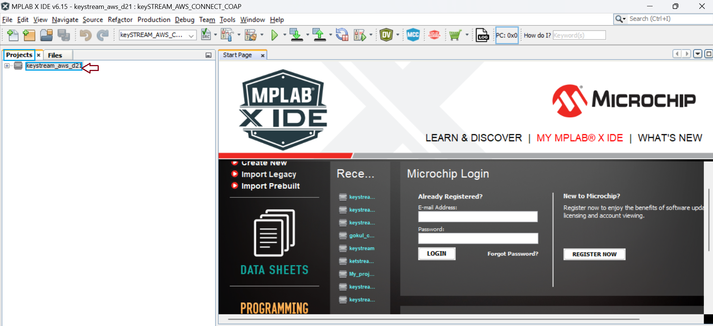<figcaption style="font-weight: bold; text-align: center; clear: both; width: 75%;">Figure 28</figcaption></figure>

    - STEP 2: Navigate to the menu bar, click on Files and then click on **Project Properties** (see **Figure 29**).
    <figure style="text-align: center;">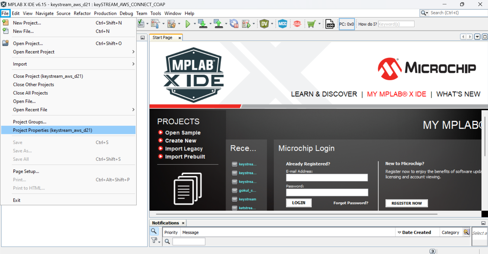<figcaption style="font-weight: bold; text-align: center; clear: both; width: 75%;">Figure 29</figcaption></figure>

    - STEP 3: Under Categories, navigate to XC32 (Global Options) and select **xc32-gcc** (see **Figure 30**).
    <figure style="text-align: center;">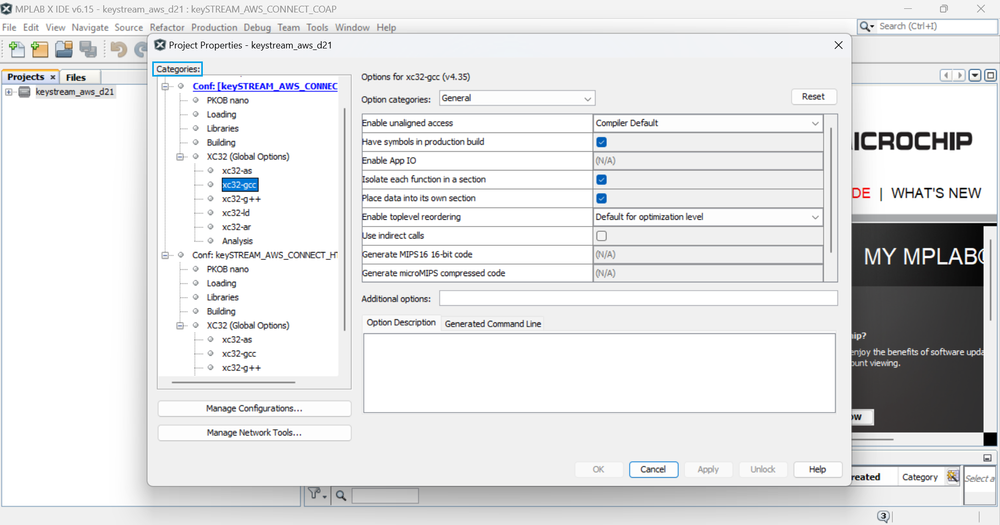<figcaption style="font-weight: bold; text-align: center; clear: both; width: 75%;">Figure 30</figcaption></figure>

    - STEP 4: In Option categories dropdown, select **processing and message** (see **Figure 31**).
    <figure style="text-align: center;">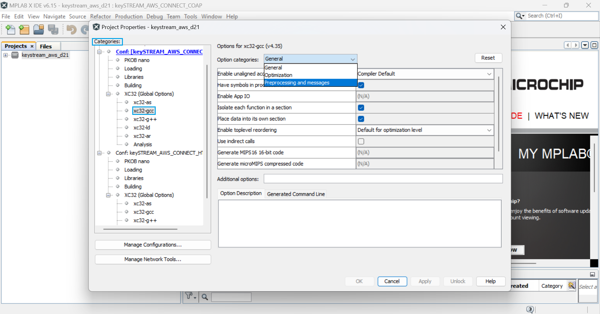<figcaption style="font-weight: bold; text-align: center; clear: both; width: 75%;">Figure 31</figcaption></figure>

    - STEP 5: After selecting Preprocessing and messages, navigate to **Preprocessor macros** and click as shown (see **Figure 32**).
    <figure style="text-align: center;">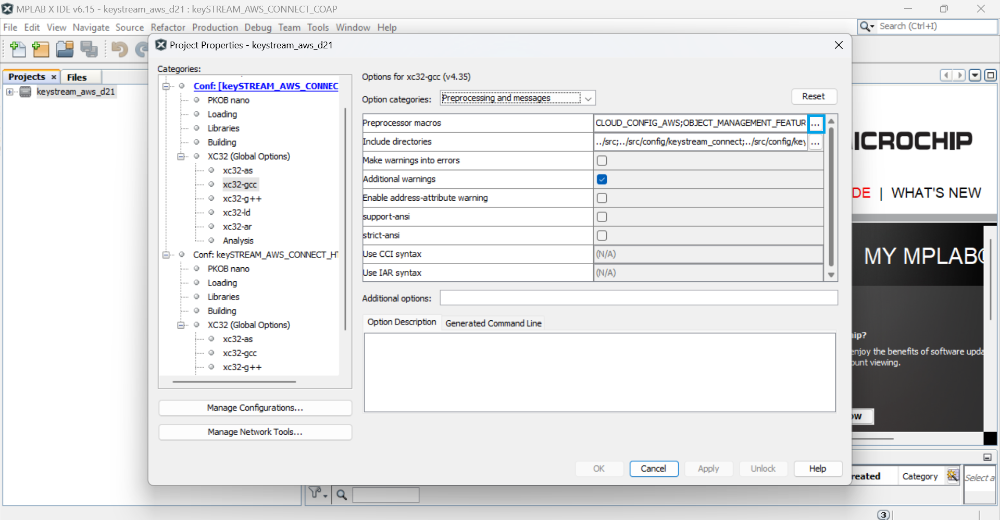<figcaption style="font-weight: bold; text-align: center; clear: both; width: 75%;">Figure 32</figcaption></figure>

    - The table below lists the different log levels:
    <figure style="text-align: center;">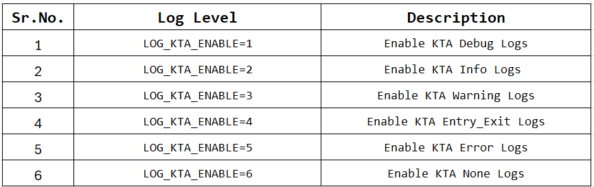<figcaption style="font-weight: bold; text-align: center; clear: both; width: 75%;">Table 1: KTA Logging Levels</figcaption></figure>

    - STEP 6: After selecting Preprocessor macros options, enter the desired log level (e.g., LOG_KTA_ENABLE=1) in the **Enter string here** field and click OK (see **Figure 33**).
    <figure style="text-align: center;">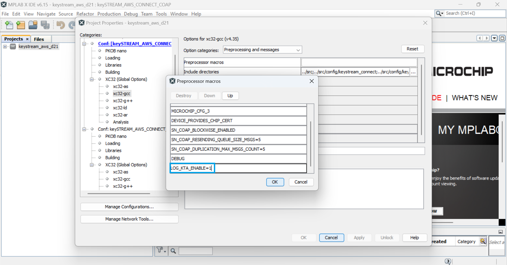<figcaption style="font-weight: bold; text-align: center; clear: both; width: 75%;">Figure 33</figcaption></figure>

    - STEP 7: Click **Apply** and **OK**, log will be enabled (see **Figure 34**).
    <figure style="text-align: center;">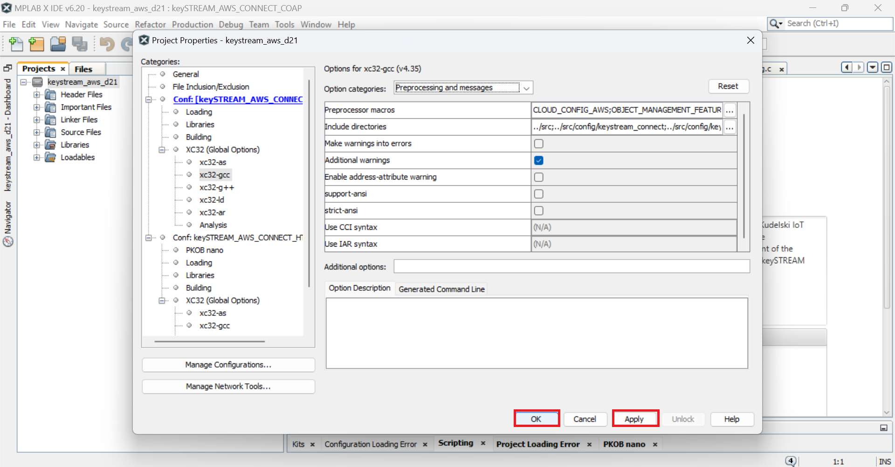<figcaption style="font-weight: bold; text-align: center; clear: both; width: 75%;">Figure 34</figcaption></figure>

---------------------------------------------------------------------------------
##  **Verify Device Connection to Cloud**

**Example TeraTerm Logs after successfully executing embedded project:**

 - **keySTREAM log During Embedded run (figure #035).**
  <figure style="text-align: center;"><figcaption style="font-weight: bold; text-align: center; clear: both; width: 60%;">Figure 035</figcaption></figure>

 - **AWS log During Embedded run (figure #036).**
  <figure style="text-align: center;"><figcaption style="font-weight: bold; text-align: center; clear: both; width: 60%;">Figure 036</figcaption></figure>

 - **Connecting to Cloud messages appear along with the led state (figure #037).**
  <figure style="text-align: center;">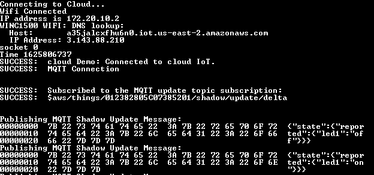<figcaption style="font-weight: bold; text-align: center; clear: both; width: 60%;">Figure 037</figcaption></figure>

