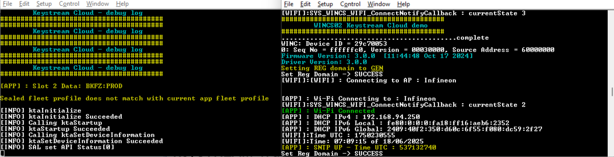

# keySTREAM Provisioning Automation

This repository contains a PowerShell script (`Config.ps1`) to automate the configuration and provisioning process for keySTREAM device firmware examples.  
It supports the following platforms:
- `d21_X`
- `same54_X`
- `sg41_X`

---

## Prerequisites

- **Windows PC**
- **PowerShell** (built-in on Windows 10/11)
- **MPLAB X IDE** (for opening the generated `.X` project files)

---

## Important Notes

- **WINCS02 (SG41_X) Status:**  
  If you do not see proper logs or if WiFi does not connect consistently on the SG41_X (WINCS02), please reset the board after opening both COM ports.  
  

- **SAME54_X Long Path Issue:**  
  The generated project path for SAME54_X may exceed Windows' maximum path length. If you encounter errors, move your repository to a shorter path (e.g., `C:\Projects\keySTREAM_provisioning-main`).

---

## Step-by-Step Instructions

### 1. Download or Clone the Repository

Download or clone this repository to any location on your PC.

For example, you might place it in your Downloads or Documents folder:
```
keySTREAM_provisioning-main
```
You can use any folder or path that is convenient for you.
### 2. Open PowerShell

Open a PowerShell window:
- Press `Win + S`, type `PowerShell`, and press `Enter`.
### 3. Navigate to the Script Directory

In PowerShell, navigate to the `PreConfigured-Examples` folder inside your cloned or extracted repository.  
For example, if you are in the root of your repository, run:

```powershell
cd .\PreConfigured-Examples
```

Or, if you are elsewhere, provide the full path to the folder:

```powershell
cd "path\to\your\keySTREAM_provisioning-main\PreConfigured-Examples"
```

*(Replace `path\to\your` with the actual path where you placed the repository.)*

### 4. Run the Configuration Script

**Description:**  
`Config.ps1` is a PowerShell script that guides you through selecting your device and configuration options, then automatically updates project files and copies all required provisioning files for your selected platform.

**Set Execution Policy for Current User:**  
Before running the script, set the execution policy for the current user:
```powershell
Set-ExecutionPolicy -Scope CurrentUser RemoteSigned
```
Execute the script:
```powershell
.\Config.ps1
```
After running the script, you may revert the execution policy if desired:
```powershell
Set-ExecutionPolicy -Scope CurrentUser Restricted
```
**If you are unable to run the script using the above method, please try the following command:**
```powershell
Set-ExecutionPolicy -Scope Process -ExecutionPolicy Bypass
```
### 5. Run the Provisioning Script

The script will guide you through:

- **Selecting a folder**: Choose the main folder (e.g., `TrustMANAGER`).
- **Selecting a device**: Choose your target device (`d21_X`, `same54_X`, or `sg41_X`).

The script will automatically update the relevant project files and copy all required provisioning files for your selected platform.

---

### 6. Configure KTA features

The KTA configuration file (`App_Config.h`) is used to set device-specific and feature options.

**Location:**  
- For all devices:  
  `<TrustMANAGER>\<Device>\keystream_connect\App_Config.h`  
  *(For `sg41_X`, the path may be: `<TrustMANAGER>\sg41_X\keystream_connect\App_Config.h`)*\
  
**Path to ktaConfig.h:**  
- **D21_X and SAME54_X:**  
    `.\TrustMANAGER\<Device>\keystream_connect\firmware\common\kta_provisioning\SOURCE\include\ktaConfig.h`
- **SG41_X (alternative path):**  
    `\TrustMANAGER\<Device>\keystream_connect\src\config\default\library\kta_lib\SOURCE\include\ktaConfig.h`


**Typical edits:**
1. Set your device's public UID for fleet profile:
    ```c
    //#define C_KTA_APP__DEVICE_PUBLIC_UID             "xxxxxxxxxxx"
    ```
    Replace `xxxxxxxxxxx` with your device UID and uncomment the line if needed.
2. Other KTA features can also be enabled/disabled from ktaConfig.h<br> For ex, Enable FOTA service
   ```c
   //#define FOTA_ENABLE
   ``` 
---

### 7. Configure App specific configuration

Update application-specific settings in the following files:

#### D21_X
- **File:** `<TrustMANAGER>\D21_X\keystream_connect\App_Config.h`
- **What to update:**  
  - WiFi SSID and Password  
  - AWS Endpoint

#### SAME54_X
- **File:** `<TrustMANAGER>\SAME54_X\keystream_connect\App_Config.h`
- **What to update:**  
  - AWS Endpoint
  - AWS Thing Name

#### SG41_X
- **File:** `<TrustMANAGER>\SG41_X\keystream_connect\App_Config.h`
- **What to update:**  
  - WiFi SSID and Password

---

#### SG41_X Dual-Port Usage

The SG41_X device uses **two ports** for operation, and logs are available in two terminals:

- **Debug Port:** For viewing debug logs.
- **Application Port:** For application communication.

**How to Use:**
- Open two terminal/serial monitor windows, one for each port.
- Once your WiFi is connected and the application starts, debug logs will appear on the Debug Port.

**Important Notes:**
- If you do not see any output on the serial monitor, or if WiFi does not connect consistently, try resetting the board after opening both COM ports. This is a known issue and is currently under investigation.
-  
  
---

### 8. Open the MPLAB X Project

After completion, the script will display the **full path** to the generated `.X` project file for your device.  
Example output:
```
=====================================================================
Next Step:
Please open the following .X project file in MPLAB X IDE to continue:

    C:\Users\<your-username>\Downloads\GitHub_Repo\keySTREAM_provisioning-main\PreConfigured-Examples\TrustMANAGER\d21_X\keystream_connect\firmware\d21_aws\keystream_aws_d21.X

=====================================================================
```
Open this file in **MPLAB X IDE** to continue your development.

---

## Notes

- You can run this script from any location on your PC.
- Make sure all required subfolders and files are present as described in the repository.
- If you encounter errors about missing files or folders, please verify your directory structure.

---

## Support

For any issues or questions, please contact your keySTREAM support representative.

---