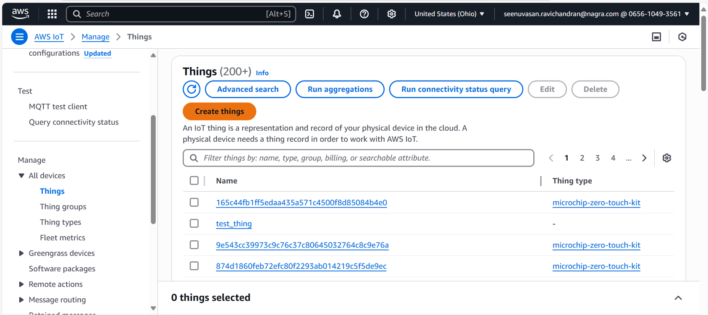
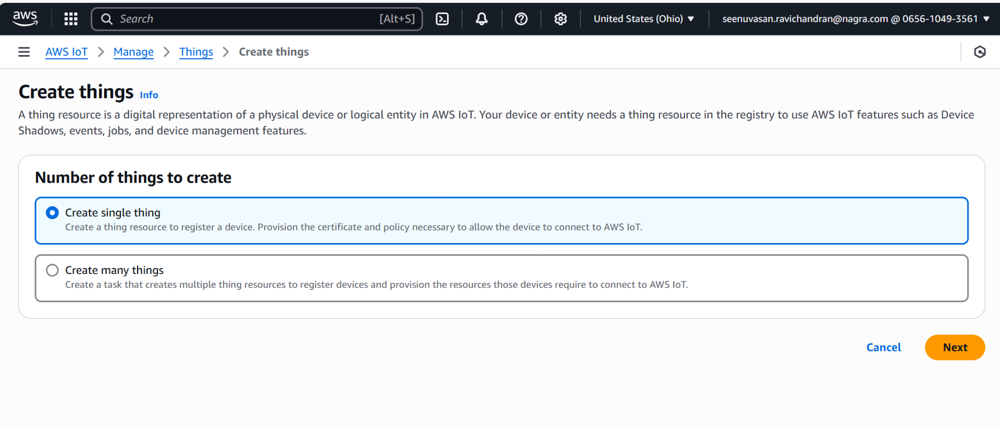
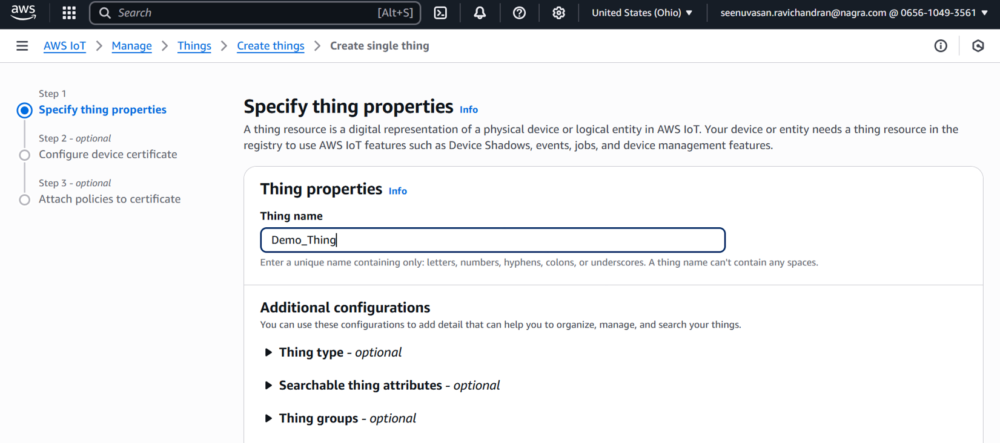
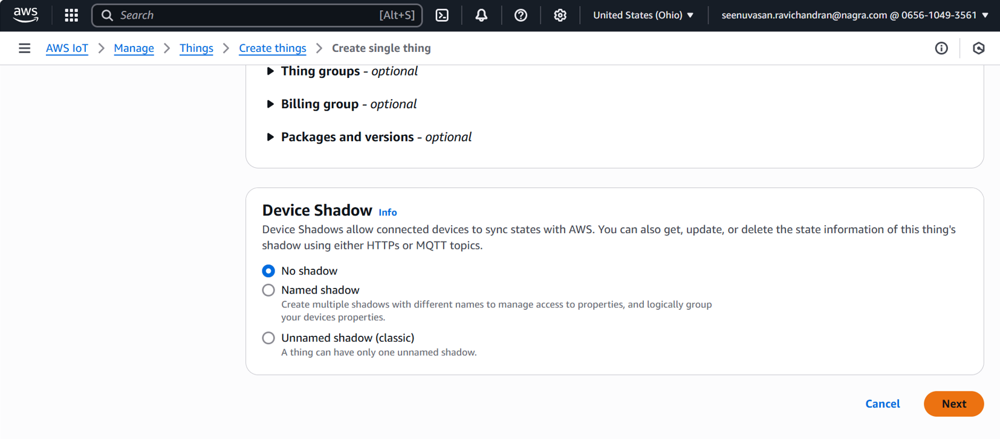
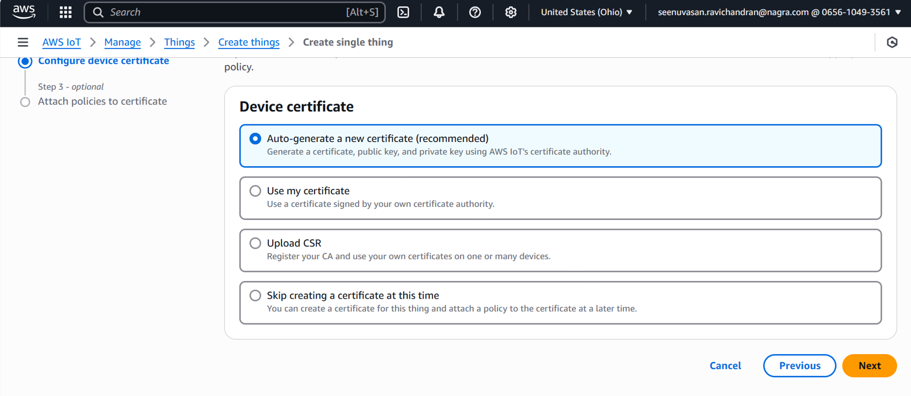
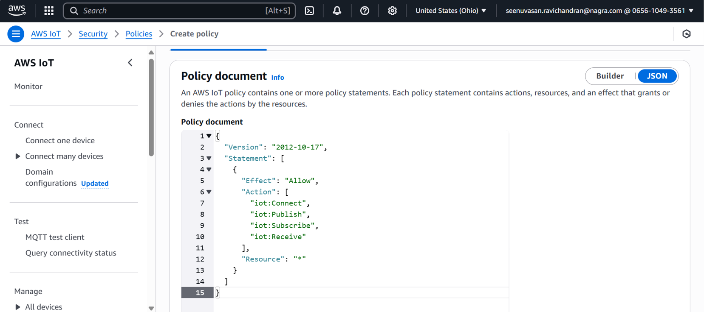
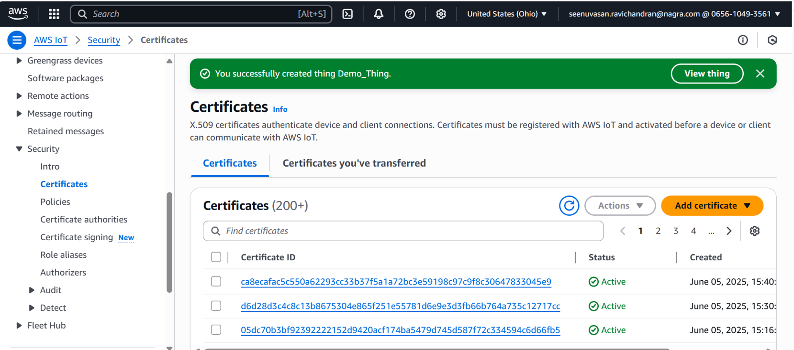
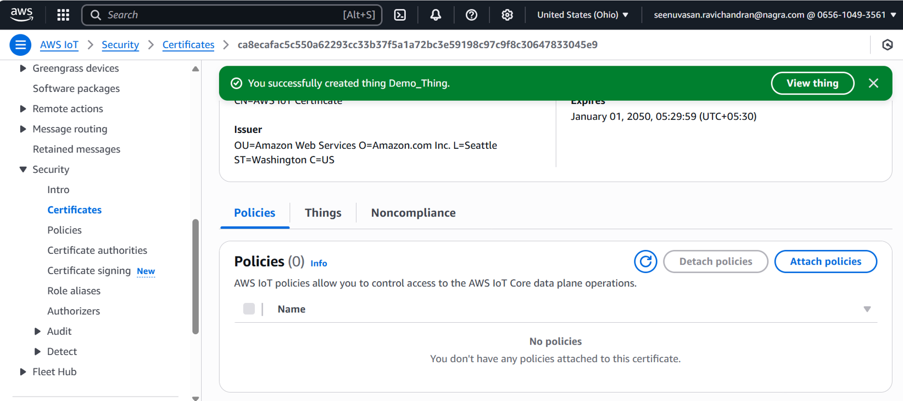
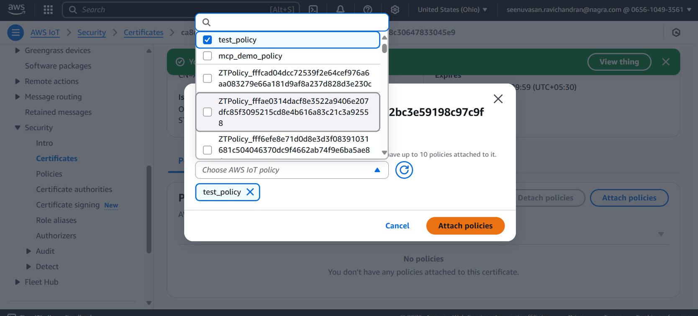

# Getting Started: AWS IoT Thing and Policy Setup for SAME54

This guide walks you through the process of creating an AWS IoT Thing, generating a policy, and attaching the policy to a certificate for your SAME54 device.  
**Screenshots are provided for each step.**

---

## Prerequisites

- An active [AWS account](https://aws.amazon.com/)
- Access to the [AWS IoT Core Console](https://console.aws.amazon.com/iot)
- Your SAME54 device and development environment

---

## 1. Create an AWS IoT Thing

1. **Navigate to AWS IoT Core Console**
   - Go to [AWS IoT Core](https://console.aws.amazon.com/iot).
2. **Go to Manage > Things**
   - Click on **Manage** in the left sidebar, then **Things** as shown below.

3. **Create a Thing**
   - Click **Create things**.
   - Choose **Create a single thing**.
   
   - Enter a unique **Thing Name** (e.g., `Demo_Thing`).
   
   - (Optional) Add attributes or type.
   - Click **Next**.
   

---

## 2. Create and Attach a Certificate

1. **Certificate Options**
   - Choose **Auto-generate a new certificate** (recommended for most users).
   - Click **Next**.
   


2. **Download Certificates**
   - Download the certificate, private key, and Amazon Root CA.

---

## 3. Create an IoT Policy

1. **Go to Secure > Policies**
   - In the left sidebar, click **Security**, then **Policies**.
2. **Create a Policy**
   - Click **Create policy**.
   - Enter a **Policy Name** (e.g., `Demo_Policy`).
   - Add a statement with the following settings:
     - **Effect:** Allow
     - **Action:**  
       ```
       iot:Connect
       iot:Publish
       iot:Subscribe
       iot:Receive
       ```
     - **Resource:** 
   - Alternatively you can click on JSON and add policy as shown below.
   

   **Example Policy JSON:**
   ```json
   {
     "Version": "2012-10-17",
     "Statement": [
       {
         "Effect": "Allow",
         "Action": [
           "iot:Connect",
           "iot:Publish",
           "iot:Subscribe",
           "iot:Receive"
         ],
         "Resource": "*"
       }
     ]
   }

   ---

## 4. Update `App_Config.h` with Your Thing Name

1. **Open the following file:**

   ```
   SAME54_X\keystream_connect\App_Config.h
   ```

2. Update the `AWS_THING_NAME` macro with your Thing Name (e.g., `Demo_Thing`).


3. **Once you have updated `App_config.h` with your Thing Name, compile and flash the project to your SAME54 device.**  
   The device will automatically begin the onboarding and certificate download process. After successful onboarding, you should see the device certificate appear in the AWS IoT Core console.

---

## 5. Attach Policy to the Certificate

After the certificate is created and visible in AWS IoT Core, you need to attach the policy to the certificate:

1. **Navigate to the Certificates section in AWS IoT Core.**

2. **Select your device certificate.**
3. **Click on "Actions" and choose "Attach policy".**

4. **Select the policy you created earlier (e.g., `Demo_Policy`) and confirm.**




## 6. Final Step: Reset and Verify Device Communication

After attaching the policy to your certificate, please reset your SAME54 device.  
Upon reboot, the device should now be able to securely communicate with AWS IoT Core, including publishing and subscribing to MQTT messages as configured.

You can monitor the device activity and message flow in the AWS IoT Core console to confirm successful connectivity.