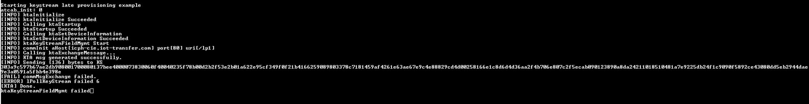

# keySTREAM Onboarding Request
This example application generates keySTREAM Onboarding Request command for keySTREAM Server.

## Description
This example application demonstrates how to use the KTA_LIB Library to call KTA Interface API's that eventually uses cryptoauthlib for its crypto Operations and generate keySTREAM Onboarding Request command for keySTREAM Server.

## Downloading and building the application

To clone or download this application from Github, go to the [main page of this repository](https://github.com/Kudelski-IoT/keySTREAM_provisioning) and then click **Clone** button to clone this repository or download as zip file.
This content can also be downloaded using content manager by following these [instructions](https://github.com/Microchip-MPLAB-Harmony/contentmanager/wiki).

Path of the application within the repository is **apps/keystream_late_provisioning_app/firmware** .

To build the application, refer to the following table and open the project using its IDE.

| Project Name      | Description                                    |
| ----------------- | ---------------------------------------------- |
| keystream_connect.X | MPLABX project for [CryptoAuth Trust Platform Development Kit](https://www.microchip.com/en-us/development-tool/DM320118) |
|||

## Setting up the hardware

The following table shows the target hardware for the application projects.

| Project Name| Board|
|:---------|:---------:|
| keystream_connect.X | [CryptoAuth Trust Platform Development Kit](https://www.microchip.com/en-us/development-tool/DM320118)
|||

### Setting up [CryptoAuth Trust Platform Development Kit](https://www.microchip.com/en-us/development-tool/DM320118)

- Connect the Debug USB port on the board to the computer using a micro USB cable

## Running the Application

1. Open the Terminal application (Ex.:Tera term) on the computer
2. Connect to the EDBG Virtual COM port and configure the serial settings as follows:
    - Baud : 115200
    - Data : 8 Bits
    - Parity : None
    - Stop : 1 Bit
    - Flow Control : None
3. Build and Program the application using its IDE
4. The console displays the following message

    